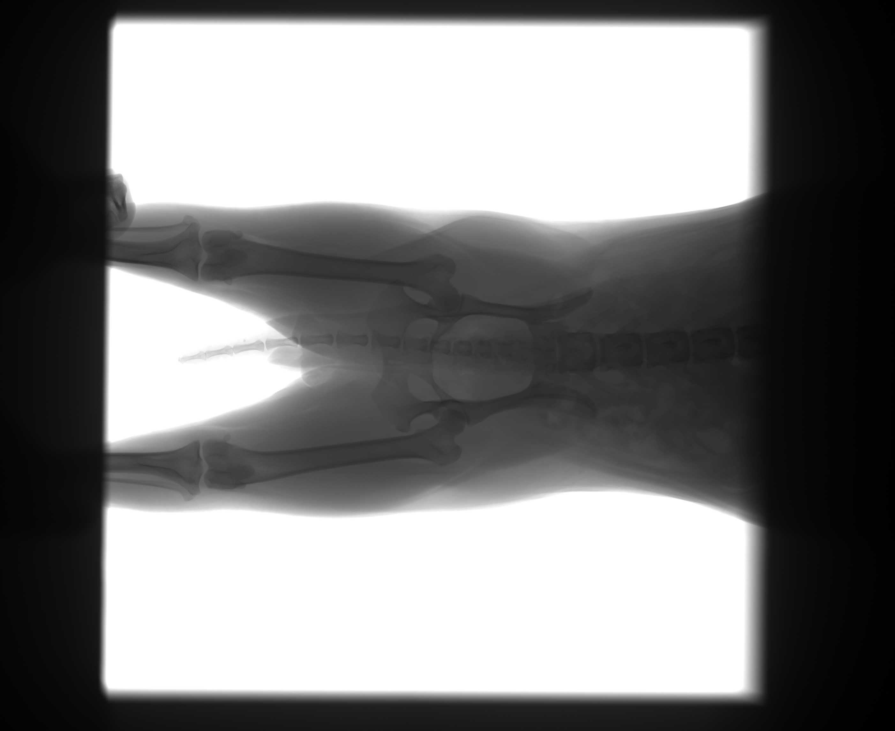
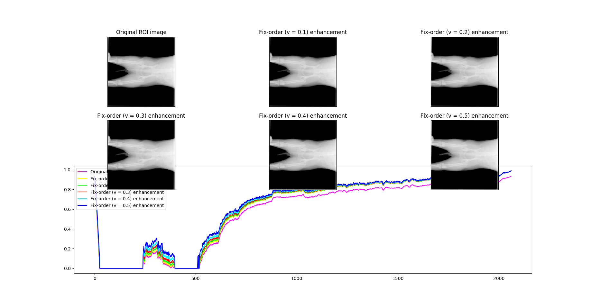

# Medical_image_enhancement_AFDA
This project pre-processed the raw image obtained from DR equipment. It mainly used for ROI extraction and contrast enhancement. Basing on the fractinal differential mask and airspace filtering, the raw image can be enhanced. 

This project tried to use [AFDA](https://www.sciencedirect.com/science/article/pii/S0045790615000580) method  to enhance the raw image, but sadly, it failed. The reason is that the gradient of many pixel is too small (<2), so the method doesn't work. Even so, I tried to use fix-order fractinal differential mask to filter the image. The results are shown below.

### Original Raw Image

### Result

